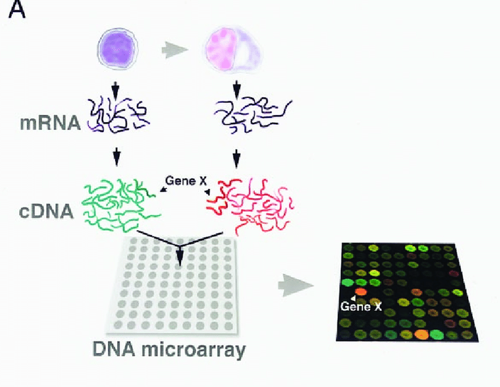

## Introduction

  Osteosarcoma is the most common primary bone tumor malignancy and demonstrates a high risk of metastasis and recurrence after therapy. It presents itself in a bimodal distribution as it is commonly observed in individuals under 25 years of age or individuals over 65 years of age. Its occurrence in young adults is mainly due to the rapid bone growth of adolescence which predisposes the individual to cancerous development. In the elderly, osteosarcoma more commonly manifests itself as a secondary malignancy to Paget disease or irradiation. 
  
  Osteosarcoma subtypes are characterized by degree of differentiation, histology, and location within the bone. The most common subtype of osteosarcoma is the intramedullary osteosarcoma which is both complex and aggressive. The most common symptom is bone pain, initially, as it is caused by activity, but as disease progresses, pain persists throughout rest. Treatment includes excision of tumor, chemotherapy, and radiation therapy. Despite the availability of treatments, patient survival rates remain low. 
    
  The etiology of osteosarcoma is currently under investigation and believed to be the result of genetic predisposition. Some of the primary mutations include: germline mutations in the RB1 gene which cause hereditary retinoblastoma, germline mutations in the TP53 tumor suppressor gene which cause Li-Fraumeni syndrome, and autosomal recessive mutations of the RECQL4 gene which cause Rothmund-Thompson syndrome. Development of any of these syndromes leads to increased risk of osteosarcoma. Although some genetic mutations have been characterized, the identification of changes in gene expression that lead to osteosarcoma would provide potential insight as to novel therapeutic strategies. Hence, this study aimed to perform a genome wide comparison of gene expression to identify genes that are differentially expressed in osteosarcoma cell lines (U2OS and MG63) as compared to normal human osteoblasts (HOB). The goal of this analysis is to visualize the data generated by this study using code generated in R. 

## Methods

This study characterized the gene expression profile of osteosarcoma cell lines U2OS and MG63 as well as normal human osteoblasts (HOB). A combination of technologies were used to generate epigenomic, genomic, and gene expression profiles. For this R analysis, however, a txt file was obtained from this study's Affymetrix Gene 1.0 platform microarray experiment. Gene expression profiling by microarray consists of a glass slide or silicon chip that contains thousands of DNA probes. These DNA probes are designed to be complimentary to mRNA or cDNA gene sequences of a sample of choice. The mRNA or cDNA of the sample will hybridize to the oligonucleotide probes. As these samples hybridize to their complementary sequence, they will cause the probe to release a signal. The more signal generated by the probe, the higher the abundance of that particular transcript. In this manner, signal intensity can dictate a quantitative measure of gene expression.  

{width=60% fig-align="center"}

## Data Analysis

### Step 1: Load packages

Load the R packages needed to analyze the expression data and create the figures shown in this report.

```{r}
#| message: false
#| warning: false
#| label: load-packages

library(limma)
library(GEOquery)
library(ggplot2)
library(pheatmap)
library(EnhancedVolcano)
library(AnnotationDbi)
library(hugene10sttranscriptcluster.db)
```

### Step 2: Import the GEO expression matrix

```{r}
#| message: false
#| warning: false
#| eval: false
#| label: import-expression-data

file_path <- "Data/GSE11414_series_matrix.txt.gz"

# Read the complete compressed GEO series-matrix file
lines <- readLines(file_path)

# Locate the expression table boundaries
table_start <- grep("!series_matrix_table_begin", lines) + 1
table_end <- grep("!series_matrix_table_end", lines) - 1

# Import only the expression table
expression_data <- read.delim(
  text = lines[table_start:table_end],
  header = TRUE,
  sep = "\t",
  quote = "\"",
  check.names = FALSE,
  stringsAsFactors = FALSE
)

# Display the dimensions of the imported table
dim(expression_data)
```

### Step 3: Prepare the expression matrix and sample metadata

```{r}
#| message: false
#| warning: false
#| eval: false
#| label: prepare-data

# Use probe IDs as row names
rownames(expression_data) <- expression_data$ID_REF

# Remove the probe-ID column and create a numeric matrix
expression_matrix <- as.matrix(expression_data[, -1])
storage.mode(expression_matrix) <- "numeric"

# Describe the six samples
sample_metadata <- data.frame(
  sample = colnames(expression_matrix),
  cell_type = factor(
    c("HOB", "HOB", "MG63", "MG63", "U2OS", "U2OS"),
    levels = c("HOB", "MG63", "U2OS")
  ),
  replicate = c(1, 2, 1, 2, 1, 2)
)

sample_metadata
```

### Step 4: Quality Assessment

```{r}
#| message: false
#| warning: false
#| eval: false
#| label: expression-boxplot
#| fig-cap: "Distribution of expression intensities across the six samples."
#| fig-width: 9
#| fig-height: 5

boxplot(
  expression_matrix,
  las = 2,
  main = "Expression distributions across samples",
  ylab = "Expression intensity"
)
```

### Step 5: Principal Component Analysis


```{r}
#| message: false
#| warning: false
#| eval: false
#| label: pca-plot
#| fig-cap: "Principal component analysis of GSE11414. Each point represents one sample."
#| fig-width: 8
#| fig-height: 6

pca_plot <- ggplot(
  pca_data,
  aes(
    x = PC1,
    y = PC2,
    color = cell_type,
    label = sample
  )
) +
  geom_point(size = 4) +
  geom_text(vjust = -0.8, show.legend = FALSE) +
  labs(
    title = "PCA of GSE11414 expression data",
    x = paste0("PC1: ", percent_variance[1], "% variance"),
    y = paste0("PC2: ", percent_variance[2], "% variance"),
    color = "Cell type"
  ) +
  theme_minimal()

pca_plot
```

### Step 6: Differential expression analysis with limma

```{r}
#| message: false
#| warning: false
#| eval: false
#| label: limma-model

# Confirm that metadata and expression columns use the same sample order
stopifnot(
  identical(
    colnames(expression_matrix),
    as.character(sample_metadata$sample)
  )
)

# Create a design matrix with one column per cell type
design <- model.matrix(
  ~0 + cell_type,
  data = sample_metadata
)
colnames(design) <- levels(sample_metadata$cell_type)

# Fit a linear model independently to each probe
fit <- lmFit(expression_matrix, design)

# Define the comparisons of interest
contrast_matrix <- makeContrasts(
  MG63_vs_HOB = MG63 - HOB,
  U2OS_vs_HOB = U2OS - HOB,
  MG63_vs_U2OS = MG63 - U2OS,
  levels = design
)

# Apply the contrasts and empirical Bayes moderation
fit2 <- contrasts.fit(fit, contrast_matrix)
fit2 <- eBayes(fit2)
```

### Step 7: Extract and filter differential expression results

```{r}
#| message: false
#| warning: false
#| eval: false
#| label: extract-results

results_MG63 <- topTable(
  fit2,
  coef = "MG63_vs_HOB",
  number = Inf,
  adjust.method = "BH",
  sort.by = "P"
)

results_U2OS <- topTable(
  fit2,
  coef = "U2OS_vs_HOB",
  number = Inf,
  adjust.method = "BH",
  sort.by = "P"
)

results_MG63_vs_U2OS <- topTable(
  fit2,
  coef = "MG63_vs_U2OS",
  number = Inf,
  adjust.method = "BH",
  sort.by = "P"
)

# Add probe IDs as regular columns
results_MG63$Probe_ID <- rownames(results_MG63)
results_U2OS$Probe_ID <- rownames(results_U2OS)
results_MG63_vs_U2OS$Probe_ID <- rownames(results_MG63_vs_U2OS)

# Apply the significance thresholds
sig_MG63 <- subset(
  results_MG63,
  adj.P.Val < 0.05 & abs(logFC) >= 1
)

sig_U2OS <- subset(
  results_U2OS,
  adj.P.Val < 0.05 & abs(logFC) >= 1
)
```

```{r}
#| message: false
#| warning: false
#| eval: false
#| label: significant-probe-summary

significant_probe_summary <- data.frame(
  Comparison = c("MG63 vs HOB", "U2OS vs HOB"),
  Significant_probes = c(nrow(sig_MG63), nrow(sig_U2OS)),
  Upregulated = c(
    sum(sig_MG63$logFC > 0),
    sum(sig_U2OS$logFC > 0)
  ),
  Downregulated = c(
    sum(sig_MG63$logFC < 0),
    sum(sig_U2OS$logFC < 0)
  )
)

knitr::kable(
  significant_probe_summary,
  caption = "Summary of significant differentially expressed probes."
)
```

### Step 8: Annotate probes with gene information

```{r}
#| message: false
#| warning: false
#| eval: false
#| label: annotate-probes

# Annotate MG63-versus-HOB results
results_MG63$SYMBOL <- mapIds(
  hugene10sttranscriptcluster.db,
  keys = results_MG63$Probe_ID,
  column = "SYMBOL",
  keytype = "PROBEID",
  multiVals = "first"
)

results_MG63$GENENAME <- mapIds(
  hugene10sttranscriptcluster.db,
  keys = results_MG63$Probe_ID,
  column = "GENENAME",
  keytype = "PROBEID",
  multiVals = "first"
)

results_MG63$ENTREZID <- mapIds(
  hugene10sttranscriptcluster.db,
  keys = results_MG63$Probe_ID,
  column = "ENTREZID",
  keytype = "PROBEID",
  multiVals = "first"
)

# Annotate U2OS-versus-HOB results
results_U2OS$SYMBOL <- mapIds(
  hugene10sttranscriptcluster.db,
  keys = results_U2OS$Probe_ID,
  column = "SYMBOL",
  keytype = "PROBEID",
  multiVals = "first"
)

results_U2OS$GENENAME <- mapIds(
  hugene10sttranscriptcluster.db,
  keys = results_U2OS$Probe_ID,
  column = "GENENAME",
  keytype = "PROBEID",
  multiVals = "first"
)

results_U2OS$ENTREZID <- mapIds(
  hugene10sttranscriptcluster.db,
  keys = results_U2OS$Probe_ID,
  column = "ENTREZID",
  keytype = "PROBEID",
  multiVals = "first"
)

annotated_MG63 <- results_MG63
annotated_U2OS <- results_U2OS

# Recreate significant tables after annotation
sig_annotated_MG63 <- subset(
  annotated_MG63,
  adj.P.Val < 0.05 & abs(logFC) >= 1
)

sig_annotated_U2OS <- subset(
  annotated_U2OS,
  adj.P.Val < 0.05 & abs(logFC) >= 1
)

# Add expression direction
sig_annotated_MG63$Direction <- ifelse(
  sig_annotated_MG63$logFC > 0,
  "Upregulated",
  "Downregulated"
)

sig_annotated_U2OS$Direction <- ifelse(
  sig_annotated_U2OS$logFC > 0,
  "Upregulated",
  "Downregulated"
)
```

```{r}
#| message: false
#| warning: false
#| eval: false
#| label: annotation-summary

annotation_summary <- data.frame(
  Comparison = c("MG63 vs HOB", "U2OS vs HOB"),
  Significant_probes = c(
    nrow(sig_annotated_MG63),
    nrow(sig_annotated_U2OS)
  ),
  Probes_with_gene_symbols = c(
    sum(!is.na(sig_annotated_MG63$SYMBOL)),
    sum(!is.na(sig_annotated_U2OS$SYMBOL))
  ),
  Unique_annotated_genes = c(
    length(unique(na.omit(sig_annotated_MG63$SYMBOL))),
    length(unique(na.omit(sig_annotated_U2OS$SYMBOL)))
  )
)

knitr::kable(
  annotation_summary,
  caption = "Annotation coverage among significant probes."
)
```

### Step 9: Volcano plots

```{r}
#| message: false
#| warning: false
#| eval: false
#| label: prepare-volcano-labels

annotated_MG63$Plot_Label <- ifelse(
  is.na(annotated_MG63$SYMBOL),
  "",
  annotated_MG63$SYMBOL
)

annotated_U2OS$Plot_Label <- ifelse(
  is.na(annotated_U2OS$SYMBOL),
  "",
  annotated_U2OS$SYMBOL
)
```

```{r}
#| message: false
#| warning: false
#| eval: false
#| label: volcano-mg63
#| fig-cap: "Volcano plot of differential expression in MG63 cells compared with HOB cells."
#| fig-width: 9
#| fig-height: 7

volcano_MG63 <- EnhancedVolcano(
  annotated_MG63,
  lab = annotated_MG63$Plot_Label,
  x = "logFC",
  y = "adj.P.Val",
  title = "MG63 versus HOB",
  subtitle = "GSE11414 differential expression",
  xlab = expression(Log[2] ~ "fold change"),
  pCutoff = 0.05,
  FCcutoff = 1,
  pointSize = 1.5,
  labSize = 3,
  drawConnectors = TRUE,
  max.overlaps = 15
)

volcano_MG63
```

```{r}
#| message: false
#| warning: false
#| eval: false
#| label: volcano-u2os
#| fig-cap: "Volcano plot of differential expression in U2OS cells compared with HOB cells."
#| fig-width: 9
#| fig-height: 7

volcano_U2OS <- EnhancedVolcano(
  annotated_U2OS,
  lab = annotated_U2OS$Plot_Label,
  x = "logFC",
  y = "adj.P.Val",
  title = "U2OS versus HOB",
  subtitle = "GSE11414 differential expression",
  xlab = expression(Log[2] ~ "fold change"),
  pCutoff = 0.05,
  FCcutoff = 1,
  pointSize = 1.5,
  labSize = 3,
  drawConnectors = TRUE,
  max.overlaps = 15
)

volcano_U2OS
```

### Step 10: Heatmap of top 50 differentially expressed genes

```{r}
#| message: false
#| warning: false
#| eval: false
#| label: prepare-heatmap

# Keep annotated probes and order by adjusted p-value
heatmap_candidates <- annotated_MG63[
  !is.na(annotated_MG63$SYMBOL) &
    annotated_MG63$SYMBOL != "",
]

heatmap_candidates <- heatmap_candidates[
  order(heatmap_candidates$adj.P.Val),
]

# Keep one probe per gene symbol and select the top 50 genes
heatmap_candidates <- heatmap_candidates[
  !duplicated(heatmap_candidates$SYMBOL),
]

top50 <- head(heatmap_candidates, 50)

# Extract expression values for the selected probes
heatmap_data <- expression_matrix[
  top50$Probe_ID,
  ,
  drop = FALSE
]

# Replace probe IDs with gene symbols
rownames(heatmap_data) <- top50$SYMBOL

# Standardize each gene across samples
heatmap_scaled <- t(scale(t(heatmap_data)))

# Create a column annotation for sample type
annotation_col <- data.frame(
  CellType = sample_metadata$cell_type
)
rownames(annotation_col) <- colnames(heatmap_scaled)
```

```{r}
#| message: false
#| warning: false
#| eval: false
#| label: top50-heatmap
#| fig-cap: "Heatmap of the 50 most statistically significant genes in the MG63-versus-HOB comparison. Values represent row-scaled expression."
#| fig-width: 8
#| fig-height: 9

pheatmap(
  heatmap_scaled,
  annotation_col = annotation_col,
  show_rownames = TRUE,
  show_colnames = TRUE,
  cluster_rows = TRUE,
  cluster_cols = TRUE,
  fontsize_row = 8,
  main = "Top 50 Differentially Expressed Genes"
)
```


## Conclusions

This dataset reveals the most differentially expressed genes in osteosarcoma cell lines U2OS and MG63 as compared to normal human osteoblasts (HOB). Future directions for this experiment would include pathway analysis in which not only changes in gene expression, but alterations in biological pathways are also studied. This would reveal which pathways osteosarcoma becomes more dependent on in a cell line model. 

## References

Add any references to papers, data sources, or resources you used.

---

**Last updated:** July 2026
